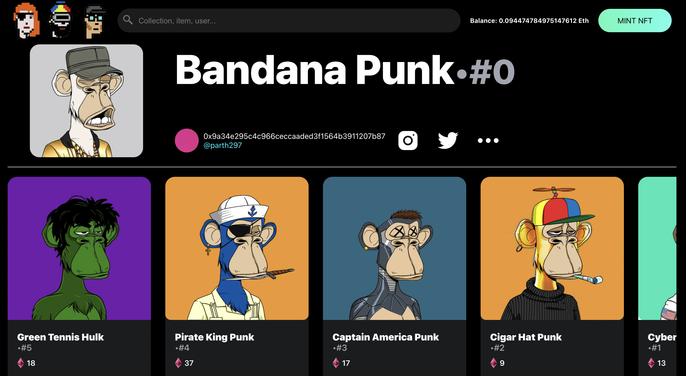
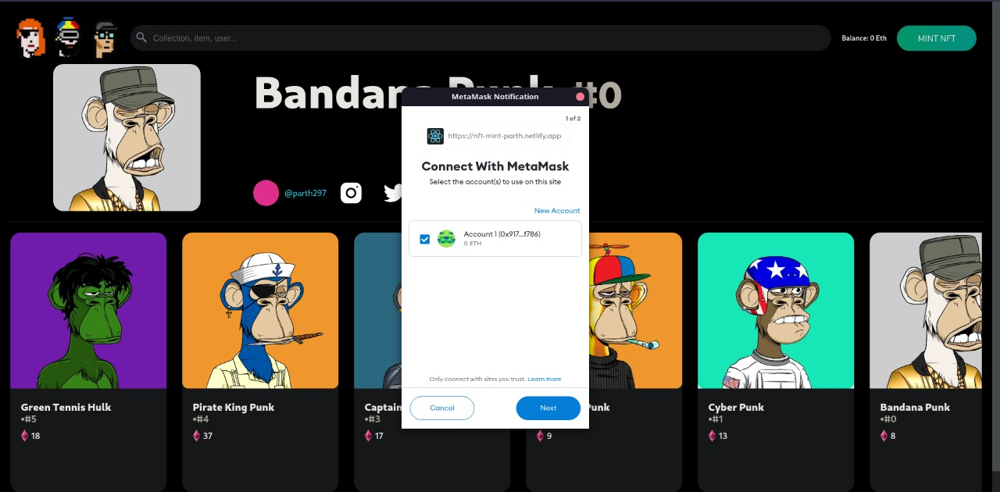
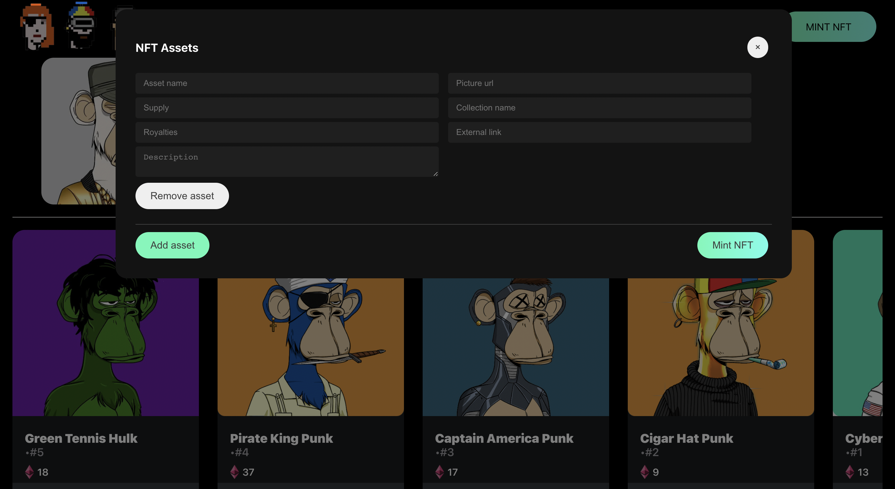

Created a small react app to mint fake NFTs in batch. In this fake scenario, minting means clicking a Mint button that can simply output the required information to mint the NFTs in the console.

Uses real information from your Metamask wallet to display the information of the user.

> Hosted on netlify: [Demo link](https://nft-mint-parth.netlify.app/)

## Tech Stack

- React Js
- Metamask
- Ether Js
- Custom CSS

## Getting started

1. Install dependencies
   ```bash
   yarn install
   ```
2. Start server
   ```bash
   yarn start
   ```

## Screenshots




